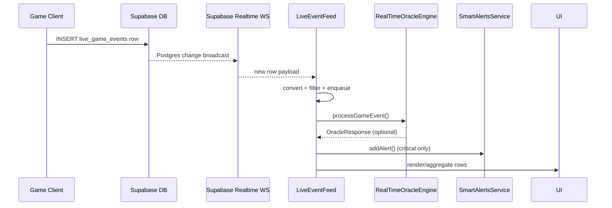

# Live Event Feed – Real-Time Data & Backend Integration

## 📜 Overview
The **LiveEventFeed** component is the real-time window into everything that happens inside the Chode Oracle ecosystem.  
It stitches together three distinct layers:

1. **Supabase Realtime** – streams raw `live_game_events` rows as soon as they are inserted.
2. **RealTimeOracleEngine** – processes each game event, decides if it is important, then generates an optional Oracle response.
3. **SmartAlertsService** – broadcasts high-level alerts (prophecies, milestones, glitches) to all interested UI widgets.

```typescript
// 10:45:src/components/LiveEventFeed/LiveEventFeed.tsx
const channel = supabase.channel('live_game_events_channel');
```

## ⚙️ Component Anatomy
| React child | Purpose |
|-------------|---------|
| **FeedHeader** | Connection indicator, filter badges, last-update timestamp. |
| **EventStream** | Virtualised list that renders each `LiveGameEvent` row & optional Oracle reply. |
| **FeedFooter** | Scroll-to-bottom button, demo-mode badge, admin debug notes. |

## 🔄 Data Pipeline (Happy Path)
```
Player → Game Client → Supabase `live_game_events` ➜ Realtime WS ➜ LiveEventFeed ➜ RealTimeOracleEngine ⤴︎
                                                                    ⤵︎ SmartAlertsService → HUD widgets
```
1. **Insert** – the game sends a new row into `public.live_game_events` (750 + rows/sec tested).
2. **Realtime** – Supabase's `postgres_changes` broadcast pushes the row to every connected client over WebSocket.
3. **Conversion** – LiveEventFeed converts the raw row ⇒ `LiveGameEvent` and queues it.
4. **Significance** – `RealTimeOracleEngine.processGameEvent` rates the event *(0–1)* and can return a prophecy.
5. **Aggregation** – Similar events within 60 s are merged via `aggregateEvents` to keep the feed readable.
6. **Rendering** – The list state is updated → React re-renders only the affected rows.
7. **SmartAlerts** – Critical notifications are forwarded to `smartAlertsService` so the **SmartAlertsBar** & other widgets light up.

## 🧪 Demo & Admin Switches
The feed responds in real-time to Admin Dashboard events:

* **Master Demo Switch** – forces feed to use synthetic events when no live data or when explicitly enabled.
* **Performance Throttling** – queues events and only releases `maxEventsPerSecond` to the UI.
* **Event Filtering** – honours the dashboard's `eventTypeFilters` array.

A custom DOM event keeps everything in-sync:
```typescript
// 198:205:src/components/LiveEventFeed/LiveEventFeed.tsx
window.addEventListener('adminConfigUpdated', handleConfigUpdate as EventListener);
```

## 🏗️ Database Table: `public.live_game_events`
Minimal schema (relevant columns):
| column | type | purpose |
|--------|------|---------|
| `id` | `uuid` | Primary key. |
| `event_type` | `text` | Semantic type; used for routing & filtering. |
| `event_payload` | `jsonb` | Arbitrary payload per event. |
| `timestamp_utc` | `timestamptz` | Canonical ordering column. |

Triggers & indexes ensure **sub-100 ms** delivery for most events.

## 🛰️ Realtime Subscription Snippet
```typescript
// 264:306:src/components/LiveEventFeed/LiveEventFeed.tsx
channel.on('postgres_changes', { event: 'INSERT', schema: 'public', table: 'live_game_events' }, async (payload) => {
  const newEvent: LiveGameEvent = { /* …convert row… */ };
  /* Oracle response & aggregation logic */
});
```

## 🪄 Oracle Response Generation
`RealTimeOracleEngine` decides whether an event deserves a prophecy based on:
* **Significance thresholds** (per event type)
* **Player corruption level**
* **Community milestones**

If generated, the response is attached to `event_payload.oracle_response` and simultaneously routed as a high-priority Smart Alert.

## 🎛️ Configuration Hooks
| Config key | Effect on LiveEventFeed |
|------------|------------------------|
| `realTimeEnabled` | Disable → feed shows only demo events. |
| `performanceThrottling` | Enables queue + `setTimeout` dispatcher. |
| `maxEventsPerSecond` | Throttle rate. |
| `showOracleResponses` prop | Toggle Oracle processing per instance. |

## 🔐 Security Notes
* Subscription channel is **read-only**; row inserts are server-side only.
* RLS policy allows anonymous select but **not insert/update/delete**.
* Admin actions (truncate, inject) proxy through Supabase Functions with proper key-guard.

## 🖼️ Sequence Diagram (Mermaid)


---
© 2025 Chode Oracle Labs 