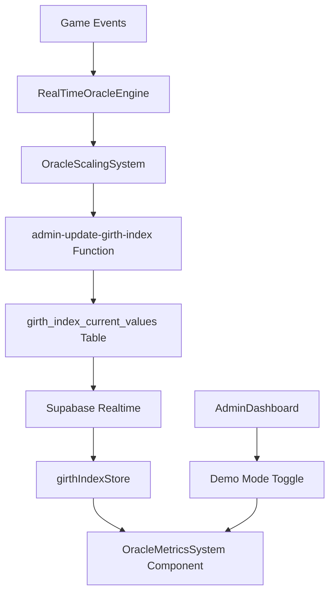

# Oracle Metrics System – Backend Integration & Scaling Analysis

## 📊 Current State Analysis

### **Component Architecture**
The `OracleMetricsSystem` is currently a **demo-only component** with static data and no backend integration. It features:

1. **Interface Structure**: MetricData + MetricCategory with modular design
2. **Demo Categories**: Resonance, Stability, Morale, Corruption, Community Pulse
3. **Static Values**: All metrics use hardcoded demo data with simulated changes
4. **Modal Details**: Rich breakdowns and status indicators
5. **No Real Data**: Zero connection to actual Oracle state or game events

### **Critical Gap Identified**
```typescript
// 🚨 CURRENT ISSUE: Pure demo implementation
const demoCategories: MetricCategory[] = [
  { id: 'resonance', metrics: [{ value: 73, status: 'good' }] } // Static!
];

// 🔧 MISSING: Real-time data integration from:
// - girth_index_current_values table
// - live_game_events stream  
// - oracleScalingSystem calculations
```

## 🗄️ Backend Data Sources

### **Primary Data Table: `girth_index_current_values`**
```sql
create table public.girth_index_current_values (
  id integer not null default 1,
  last_updated timestamp with time zone not null default now(),
  divine_girth_resonance numeric null default 50.0,        -- 🌟 Divine Resonance %
  tap_surge_index text null default 'Steady Pounding',     -- ⚡ Activity Level  
  legion_morale text null default 'Cautiously Optimistic', -- 💪 Community Mood
  oracle_stability_status text null default 'Pristine',   -- 🔮 System Health
  -- Change tracking for trend calculations
  previous_tap_surge_index text null,
  previous_legion_morale text null,
  previous_oracle_stability_status text null
);
```

### **Supporting Data Sources**
| Table | Purpose | Metrics Impact |
|-------|---------|----------------|
| `live_game_events` | Real-time player activity | Drives scaling calculations |
| `oracle_responses` | Oracle AI activity | System processing load |
| `user_votes` | Community engagement | Morale & community pulse |
| `chode_lore_entries` | Content generation | Corruption levels |
| `player_states` | Active player count | Community metrics |

## ⚙️ Scaling System Integration

### **Current Scaling Engine**
The `oracleScalingSystem.ts` provides **single-player optimized** calculations:

```typescript
// 🎯 MVP FOCUS: Designed for one person to see changes in 30-minute session
export class OracleScalingSystem {
  calculateAllMetrics(activity: PlayerActivity, community: CommunityActivity): {
    metrics: OracleMetrics,
    all_influences: Record<string, any>
  }
}
```

### **Scaling Thresholds (Single Player)**
```typescript
const MVP_SCALING = {
  TAPS_FOR_SURGE_UPGRADE: {
    'STEADY_POUNDING': 30,    // 30 taps/min for 2 minutes
    'FRENZIED_SLAPPING': 60,  // 60 taps/min for 3 minutes  
    'MEGA_SURGE': 120,        // 120 taps/min for 5 minutes
    'GIGA_SURGE': 200,        // 200 taps/min sustained
  },
  SESSION_DURATION_TARGET: 30, // 30-minute sessions
  DECAY_RATES: {
    divine_resonance: 0.5,   // Lose 0.5% per minute inactive
    legion_morale: 1.0,      // Faster morale decay  
    oracle_stability: 0.2    // Stability decays slowly
  }
};
```

## 🔄 Data Flow Architecture

### **Real-Time Pipeline**


### **Component Integration Points**
1. **girthIndexStore.ts** - Manages real-time Supabase connection
2. **AdminDashboard.tsx** - Controls demo/live data toggle
3. **realTimeOracleEngine.ts** - Processes game events → metrics
4. **oracleScalingSystem.ts** - Calculates metric changes
5. **aggregate-game-events** - Backend processing pipeline

## 🎛️ Demo vs Live Data Strategy

### **Admin Configuration**
```typescript
// AdminDashboard controls
interface AdminConfig {
  componentDemoModes: {
    oracleMetrics: boolean  // 🔧 Toggle demo/live mode
  }
  oracleMetrics: {
    showInfluences: boolean      // Show calculation breakdowns
    autoRefresh: boolean         // Real-time updates
    refreshInterval: number      // Update frequency (seconds)
    sensitivityLevel: 'low' | 'medium' | 'high'  // Scaling responsiveness
  }
}
```

### **Hybrid Data Approach**
- **Demo Mode**: Static categories with animated value changes
- **Live Mode**: Real data from `girth_index_current_values` + scaling system
- **Development**: Configurable via admin panel for testing/demos
- **Production**: Automatic live data with admin override capability

## 🚀 Implementation Strategy

### **Phase 1: Data Service Integration** ⏱️ *2-3 hours*
1. Create `OracleMetricsService` to bridge data sources
2. Connect `girthIndexStore` to component
3. Map database fields to MetricData interface
4. Implement real-time subscriptions

### **Phase 2: Scaling System Connection** ⏱️ *3-4 hours*  
1. Integrate `oracleScalingSystem` calculations
2. Add influence breakdown from scaling factors
3. Connect to `live_game_events` stream for real-time updates
4. Implement trend calculation (current vs previous values)

### **Phase 3: Admin Controls** ⏱️ *2-3 hours*
1. Add Oracle Metrics toggle to AdminDashboard
2. Implement demo data injection controls
3. Add configuration for scaling sensitivity
4. Create metrics testing/simulation tools

### **Phase 4: Production Optimization** ⏱️ *2-3 hours*
1. Performance optimization for real-time updates
2. Error handling and fallback to demo data
3. Caching strategy for expensive calculations
4. Mobile responsiveness enhancements

## 📋 Component Mapping Strategy

### **MetricCategory Mapping**
```typescript
// Map Oracle state to component categories
const mapDatabaseToCategories = (oracleState: GirthIndexValues): MetricCategory[] => [
  {
    id: 'resonance',
    metrics: [{
      id: 'divine_resonance',
      name: 'Divine Girth Resonance',
      value: oracleState.divine_girth_resonance,
      trend: calculateTrend(current, previous),
      status: getResonanceStatus(oracleState.divine_girth_resonance)
    }]
  },
  {
    id: 'activity', 
    metrics: [{
      id: 'tap_surge',
      name: 'Tap Surge Index',
      value: TAP_SURGE_STATES[oracleState.tap_surge_index].label,
      status: getSurgeStatus(oracleState.tap_surge_index)
    }]
  },
  // ... morale, stability, community
];
```

### **Trend Calculation**
```typescript
const calculateTrend = (current: number, previous: number): 'up' | 'down' | 'stable' => {
  const threshold = 2; // 2% change threshold
  const change = ((current - previous) / previous) * 100;
  
  if (Math.abs(change) < threshold) return 'stable';
  return change > 0 ? 'up' : 'down';
};
```

## 🎯 Single-Player Optimization

### **Responsive Scaling**
The current scaling system is **perfectly designed** for single-player Oracle testing:

- **30-minute sessions** show meaningful progression  
- **Sensitive thresholds** respond to individual activity
- **Decay mechanics** create urgency for continued engagement
- **MVP scaling** ensures one person can trigger all states

### **Testing Scenarios**
```typescript
// Demonstration progression (30-minute session)
const testingFlow = {
  '0-5min': 'STEADY_POUNDING → divine_resonance: 50%',
  '5-10min': 'FRENZIED_SLAPPING → divine_resonance: 65%', 
  '10-15min': 'MEGA_SURGE → divine_resonance: 80%',
  '15-20min': 'Achievement unlocks → legion_morale: INSPIRED',
  '20-25min': 'Sustained activity → oracle_stability: RADIANT_CLARITY',
  '25-30min': 'GIGA_SURGE → divine_resonance: 95%, morale: FANATICAL'
};
```

## ✅ Success Criteria

### **Functional Requirements**
- [ ] Real-time metrics update from game activity
- [ ] Admin toggle between demo/live modes  
- [ ] Trend indicators show actual value changes
- [ ] Breakdown shows scaling influences
- [ ] Performance: <100ms update latency

### **User Experience Goals**
- [ ] Hackathon demos: Immediate visual feedback from tapping
- [ ] Production readiness: Handles real player data
- [ ] Admin control: Easy switching for presentations
- [ ] Visual polish: Smooth transitions, no loading flickers

### **Technical Validation**
- [ ] Connects to `girth_index_current_values` table
- [ ] Integrates with `oracleScalingSystem` calculations  
- [ ] Responds to `live_game_events` in real-time
- [ ] Admin panel controls work correctly
- [ ] Mobile responsive design maintained

---

## 🎮 Testing Plan

### **Demo Mode Validation**
1. **Static Demo**: Verify demo categories display correctly
2. **Admin Toggle**: Confirm demo/live switching works
3. **Simulation**: Test demo data injection from admin panel

### **Live Data Integration**  
1. **Database Connection**: Verify realtime subscription works
2. **Game Event Response**: Test metrics change from actual tapping
3. **Scaling Calculation**: Validate influence breakdowns match scaling system
4. **Performance**: Measure update latency under load

### **Production Readiness**
1. **Error Handling**: Test behavior when database unavailable  
2. **Fallback Logic**: Ensure demo mode works if live data fails
3. **Mobile Performance**: Validate smooth operation on devices
4. **Cross-browser**: Test real-time updates across browsers

This Oracle Metrics System will become the **heart of Oracle consciousness visualization** - showing real-time awareness of community activity with beautiful, responsive feedback that makes every tap feel meaningful! 🔮✨ 