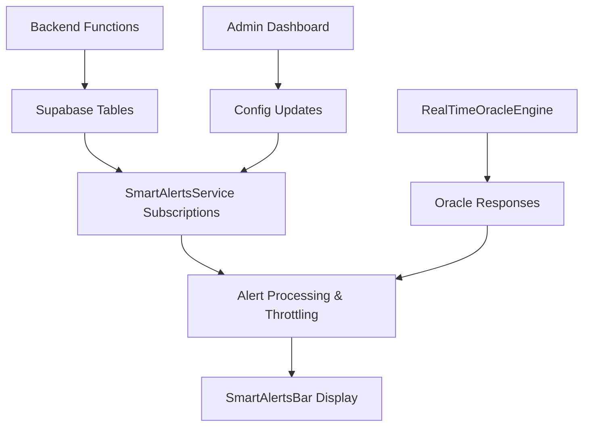

# 🚨 Smart Alerts Integration Guide

## Overview

The SmartAlertsBar system has been completely integrated with real backend data sources and comprehensive admin controls. This replaces the previous mock-only system with a production-ready alert system that connects to all major Oracle backend functions.

## 🎛️ Admin Dashboard Integration

### Admin Panel Access
- **URL**: `/admin`
- **Authentication**: Requires wallet connection with admin address: `6kVcqctFCECDapMxtBsi87SqqZYDyzgyHn3MM2gNJtgK`
- **Location**: Third panel in admin dashboard (cyber-gold themed)

### Admin Controls

#### **Demo Mode Toggle**
- **Purpose**: Switch between demo alerts and real backend data
- **Demo Mode ON**: Shows mock alerts for presentations/demos
- **Demo Mode OFF**: Uses real backend data from Supabase

#### **Real-time Backend Toggle**
- **Purpose**: Enable/disable live backend data sources
- **When Enabled**: Subscribes to real-time Supabase changes
- **When Disabled**: Uses static/cached data only

#### **Backend Data Sources**
Individual toggles for each data source:

1. **Oracle Communication** ⚡
   - Oracle responses (`oracle_responses` table)
   - Live game events processing
   - Oracle prophecy generation

2. **Community Data** 👥
   - Oracle Referendum polls (`oracle_polls` table)
   - Poll voting activity (`oracle_poll_votes` table)
   - Community milestone achievements

3. **Game Events** 🎮
   - Live game metrics (`girth_index_current_values` table)
   - Player achievements and milestones
   - Significant gameplay events

4. **Lore System** ✨
   - New lore entries (`chode_lore_entries` table)
   - Lore generation cycles (`lore_cycles` table)
   - Community story contributions (`community_story_inputs` table)

### Testing Tools

#### **Test SmartAlerts Button**
- **Location**: System Administration panel
- **Function**: Sends test alert directly to SmartAlertsBar
- **Purpose**: Verify admin-to-alerts communication pipeline

## 🔧 Technical Architecture

### Core Components

#### **1. SmartAlertsService (`src/lib/smartAlertsService.ts`)**
- **Singleton service** managing all alert operations
- **Configuration management** via localStorage
- **Real-time subscriptions** to Supabase tables
- **Alert throttling** to prevent spam
- **Backend source routing** based on admin settings

#### **2. Enhanced SmartAlertsBar (`src/components/SmartAlertsBar/SmartAlertsBar.tsx`)**
- **Backend integration** via SmartAlertsService
- **Admin config listening** for real-time updates
- **Demo/production mode switching**
- **Enhanced alert dismissal** with backend sync

#### **3. RealTimeOracleEngine Integration (`src/lib/realTimeOracleEngine.ts`)**
- **Oracle response forwarding** to SmartAlertsBar
- **Alert format conversion** from Oracle notifications
- **Corruption influence** and metadata handling

### Data Flow



## 📊 Backend Function Integration

### Oracle Communication Functions

#### **`oracle-live-communication`**
- **Triggers**: Real-time Oracle responses to game events
- **Alert Type**: `prophecy`
- **Table**: `oracle_responses`
- **Subscription**: `INSERT` events

#### **`oracle-prophecy-generator`**
- **Triggers**: System-generated prophecies based on metrics
- **Alert Type**: `prophecy` 
- **Integration**: Via `oracle_responses` table

### Community Data Functions

#### **`oracle-polls-list`**
- **Triggers**: New Oracle Referendum polls created
- **Alert Type**: `poll`
- **Table**: `oracle_polls`
- **Events**: `INSERT` (new polls), `UPDATE` (poll status changes)

#### **`oracle-vote`**
- **Triggers**: Voting activity on polls
- **Alert Type**: `community`
- **Table**: `oracle_poll_votes`
- **Throttling**: 5-minute cooldown to prevent spam

### Game Events Functions

#### **`ingest-chode-event`**
- **Triggers**: Significant game events (evolutions, achievements)
- **Alert Type**: `milestone`, `community`
- **Table**: `live_game_events`
- **Filtering**: Only processes high-significance events

#### **`aggregate-game-events`**
- **Triggers**: Community milestone tracking
- **Alert Type**: `milestone`
- **Table**: `girth_index_current_values`
- **Thresholds**: Divine resonance ≥90%, major metric changes

### Lore System Functions

#### **`generate-lore-cycle`**
- **Triggers**: New lore entries created
- **Alert Type**: `community`
- **Table**: `chode_lore_entries`
- **Events**: `INSERT` for new lore fragments

#### **`collect-community-input`**
- **Triggers**: Community story contributions
- **Alert Type**: `community`
- **Table**: `community_story_inputs`
- **Throttling**: 10-minute cooldown

## 🎯 Alert Types & Priorities

### Alert Categories

1. **Prophecy** 🔮
   - Oracle responses and visions
   - Priority: High to Critical
   - Auto-hide: Based on Oracle duration settings

2. **Poll** 📊
   - New polls, voting deadlines, results
   - Priority: Medium to High
   - Auto-hide: False (requires manual dismissal)

3. **Milestone** 💎
   - Achievements, evolutions, community goals
   - Priority: High
   - Auto-hide: False

4. **Glitch** ⚡
   - System anomalies, corruption events
   - Priority: Critical
   - Auto-hide: True (8 seconds)

5. **Community** 🌟
   - Player activities, contributions
   - Priority: Low to Medium
   - Auto-hide: True (10-12 seconds)

6. **System** 👁️
   - Admin actions, system status
   - Priority: Medium
   - Auto-hide: True (8 seconds)

### Priority Mapping

- **Critical**: Legendary Oracle events, critical system issues
- **High**: Major milestones, new polls, important prophecies
- **Medium**: Regular achievements, poll updates, standard Oracle responses
- **Low**: Background activity, community contributions

## 🔄 Real-time Subscription Details

### Supabase Channels

Each backend source creates dedicated Supabase real-time channels:

```typescript
// Oracle Communication
'oracle_responses_alerts' -> oracle_responses table
'live_events_oracle_alerts' -> live_game_events table

// Community Data  
'oracle_polls_alerts' -> oracle_polls table
'oracle_votes_alerts' -> oracle_poll_votes table

// Lore System
'lore_entries_alerts' -> chode_lore_entries table
'lore_cycles_alerts' -> lore_cycles table
'community_inputs_alerts' -> community_story_inputs table

// Game Events
'game_metrics_alerts' -> girth_index_current_values table
```

### Throttling & Performance

#### **Alert Throttling**
- **Poll Activity**: 5-minute cooldown
- **Community Input**: 10-minute cooldown
- **Maximum Alerts**: 20 alerts retained (oldest removed)

#### **Performance Optimization**
- **Subscription Management**: Dynamic enable/disable based on admin settings
- **Memory Management**: Automatic cleanup on component unmount
- **Error Handling**: Graceful degradation if backend unavailable

## 📋 Configuration Storage

### LocalStorage Keys

```typescript
// SmartAlerts Configuration
'smart_alerts_config' -> SmartAlertsConfig object

// Admin Configuration  
'oracle_admin_config' -> AdminConfig object

// Throttling Timestamps
'smart_alerts_last_poll_activity' -> timestamp
'smart_alerts_last_community_input' -> timestamp
```

### Configuration Sync

- **Admin Panel**: Updates trigger immediate service reconfiguration
- **Cross-Component**: Custom events notify all listening components
- **Persistence**: All settings saved to localStorage automatically

## 🧪 Testing Guide

### Admin Panel Testing

1. **Access Admin Panel**:
   ```
   Navigate to /admin
   Connect wallet with admin address
   ```

2. **Test Demo Mode**:
   ```
   Toggle "Demo Mode" ON
   Verify demo alerts appear in SmartAlertsBar
   Toggle "Demo Mode" OFF
   Verify demo alerts disappear
   ```

3. **Test Backend Sources**:
   ```
   Enable "Real-time Backend"
   Toggle individual data sources
   Verify subscription setup in console logs
   ```

4. **Test Alert Generation**:
   ```
   Click "Test SmartAlerts" button
   Verify test alert appears immediately
   Verify alert auto-dismisses after 8 seconds
   ```

### Backend Integration Testing

1. **Oracle Communication**:
   ```
   Trigger Oracle responses via game events
   Check oracle_responses table for new entries
   Verify alerts appear with correct Oracle styling
   ```

2. **Community Data**:
   ```
   Create new Oracle Referendum poll
   Vote on existing polls
   Check for poll-related alerts
   ```

3. **Lore System**:
   ```
   Submit community story input
   Wait for lore generation cycle
   Check for lore-related alerts
   ```

## 🚀 Production Deployment

### Environment Setup

1. **Admin Access**:
   ```typescript
   // Update admin wallet address in AdminDashboard.tsx
   const ADMIN_WALLET_ADDRESS = "YOUR_ADMIN_WALLET_ADDRESS"
   ```

2. **Default Configuration**:
   ```typescript
   // Production defaults in SmartAlertsService
   {
     demoMode: false,
     realTimeEnabled: true,
     backendSources: {
       oracleCommunication: true,
       communityData: true,
       gameEvents: true,
       loreSystem: true
     }
   }
   ```

3. **Supabase Requirements**:
   - Real-time subscriptions enabled
   - Proper RLS policies for all tables
   - Webhook endpoints configured (if needed)

### Performance Monitoring

- **Alert Volume**: Monitor alert generation frequency
- **Subscription Health**: Check Supabase connection status  
- **Error Rates**: Watch console for subscription errors
- **Memory Usage**: Monitor for memory leaks in long sessions

## 🔮 Future Enhancements

### Planned Features

1. **Alert Categories**: User-customizable alert filtering
2. **Notification Sounds**: Audio alerts for high-priority events
3. **Alert History**: Persistent storage of dismissed alerts
4. **Email/Push**: External notification delivery
5. **Analytics**: Alert engagement and effectiveness metrics

### Integration Opportunities

1. **Discord Bot**: Forward critical alerts to Discord channels
2. **Telegram**: Real-time alert delivery to Telegram groups
3. **Mobile App**: Push notifications for mobile users
4. **Oracle AI**: AI-powered alert summarization and insights

---

## 📞 Support & Debugging

### Common Issues

1. **No Alerts Appearing**:
   - Check admin panel demo mode setting
   - Verify real-time backend enabled
   - Check browser console for subscription errors

2. **Demo Alerts Not Showing**:
   - Verify demo mode is enabled
   - Check SmartAlertsBar component mounting
   - Clear localStorage and refresh

3. **Backend Alerts Missing**:
   - Check Supabase connection
   - Verify RLS policies allow reads
   - Check specific data source toggles

### Debug Commands

```javascript
// Check current SmartAlerts configuration
import('./src/lib/smartAlertsService').then(s => console.log(s.smartAlertsService.getConfig()))

// Manual alert injection
import('./src/lib/smartAlertsService').then(s => s.smartAlertsService.addAlert({
  id: 'debug_' + Date.now(),
  source: 'system', 
  type: 'system',
  title: 'Debug Alert',
  message: 'Testing manual alert injection',
  icon: '🔧',
  priority: 'medium',
  timestamp: new Date()
}))
```

The SmartAlertsBar is now a fully integrated, production-ready alert system that bridges all major Oracle backend functions with beautiful real-time user notifications!

# 🚨 Smart Alerts Integration Documentation

## **✅ Phase 1: Oracle Communication Alerts - COMPLETED** 🔮

### **Implementation Overview**
Successfully implemented **highly selective** Oracle Communication alerts that focus on rare, significant events while leaving common events to the LiveEventFeed component.

### **🎯 Data Source Analysis**
- ✅ **9 prophecies** in `apocryphal_scrolls` (7 pristine, 2 flickering - perfect for corruption testing)
- ✅ **4 legendary events** out of 981 total game events (0.4% rarity)
- ✅ **All legendary events** are `giga_slap_burst` with `oracle_significance: \"legendary\"`
- ✅ Perfect separation: SmartAlerts gets rare events, LiveEventFeed gets everything

### **🚨 Alert Types Implemented**

#### **🔮 Prophecy Born Alerts**
- **Trigger**: New `apocryphal_scrolls` entries + **existing recent prophecies on startup**
- **Icon**: Corruption-level specific (✨ pristine, 🔮 cryptic, ⚡ flickering, etc.)
- **Priority**: `high` for pristine, `critical` for corrupted
- **Message**: `\"New divine vision received: [prophecy preview]\"`

#### **⚡ Legendary Events**
- **Trigger**: `live_game_events` with `oracle_significance: \"legendary\"` + **existing recent events on startup**
- **Filter**: Ultra-selective (0.4% of events = 4 out of 981)
- **Priority**: `critical` (maximum significance)
- **Message**: Detailed slap data with streaks and power metrics

#### **🌀 Corruption Alerts**
- **Trigger**: Non-pristine prophecies (flickering, glitched_ominous, forbidden_fragment)
- **Behavior**: Auto-hide after 12 seconds (non-dismissible)
- **Priority**: `critical` with glitch styling

### **🎛️ Admin Controls Implemented**

#### **Master Oracle Communication Toggle**
- **Location**: Admin Panel → SmartAlerts Configuration → Oracle Communication ⚡
- **Effect**: Enables/disables all Oracle Communication alerts

#### **Granular Sub-Controls**
- **🔮 Prophecy Alerts**: New divine visions and recent prophecies
- **⚡ Legendary Events**: Ultra-rare game events (0.4% threshold)
- **🌀 Corruption Alerts**: Reality distortion alerts
- **📊 Legendary Threshold**: Slider 50%-100% (currently 90%)

### **🔧 Technical Implementation**

#### **Real-time Subscriptions**
```javascript
// Prophecy Born (apocryphal_scrolls INSERT)
supabase.channel('oracle_prophecy_alerts')
  .on('postgres_changes', { event: 'INSERT', table: 'apocryphal_scrolls' })

// Legendary Events (live_game_events INSERT with legendary filter)
supabase.channel('oracle_legendary_events')
  .on('postgres_changes', { event: 'INSERT', table: 'live_game_events' })

// Corruption Updates (apocryphal_scrolls UPDATE)
supabase.channel('oracle_corruption_alerts')
  .on('postgres_changes', { event: 'UPDATE', table: 'apocryphal_scrolls' })
```

#### **Initial Alert Seeding**
- **`loadRecentProphecies()`**: Loads last 3 prophecies on startup
- **`loadRecentLegendaryEvents()`**: Loads last 2 legendary events on startup
- **Why needed**: Supabase real-time only fires for NEW changes after subscription

#### **Alert Processing Flow**
1. **Admin enables Oracle Communication** → Triggers `updateSubscriptions()`
2. **Subscriptions established** → Sets up real-time listeners
3. **Initial data loaded** → `loadRecentProphecies()` + `loadRecentLegendaryEvents()`
4. **Alerts created** → `handleProphecyBorn()` + `handleLegendaryGameEvent()`
5. **UI updated** → SmartAlertsBar receives alerts via callback

### **🧪 Phase 1 Testing Guide**

#### **Expected Behavior**
When you enable Oracle Communication in Admin Panel, you should immediately see:
- **3 prophecy alerts** (including test prophecy with flickering corruption)
- **2 legendary event alerts** (giga_slap_burst events)
- **Total: 5 alerts** in SmartAlertsBar

#### **Testing Steps**
1. **Open Developer Console** (F12)
2. **Navigate to Admin Panel** (`/admin`)
3. **Enable Oracle Communication**:
   - Toggle **Oracle Communication ⚡** to ON
   - Enable **🔮 Prophecy Alerts**
   - Enable **⚡ Legendary Events**
4. **Return to main page**
5. **Check SmartAlertsBar** (should show alerts, not \"cosmic silence\")

#### **🔍 Console Debugging - What to Look For**

##### **Step 1: Service Initialization**
```
🚨 Setting up Oracle Communication alerts (Phase 1: Selective)...
🔮 Subscribed to prophecy alerts
⚡ Subscribed to legendary game events
```

##### **Step 2: Initial Data Loading**
```
🔮 Loading recent prophecies for initial alerts...
🔮 Found 3 recent prophecies, creating alerts...
⚡ Loading recent legendary events for initial alerts...
⚡ Found 2 recent legendary events, creating alerts...
```

##### **Step 3: Alert Creation**
```
🚨 Adding new alert: oracle prophecy Oracle Prophecy Born
🚨 Alert details: {id: \"prophecy_10dec466...\", source: \"oracle\", ...}
🚨 Total alerts now: 1
⚡ LEGENDARY EVENT DETECTED: giga_slap_burst {...}
🚨 Adding new alert: oracle milestone LEGENDARY GIGA SLAP BURST
🚨 Total alerts now: 2
```

##### **Step 4: SmartAlertsBar Integration**
```
🚨 SmartAlertsBar initializing: {
  shouldUseBackend: true,
  demoMode: false,
  realTimeEnabled: true,
  adminConfigFull: {...}
}
🚨 Callbacks notified. Callback count: 1
```

#### **🚨 Troubleshooting Issues**

##### **Issue 1: \"Cosmic Silence\" (No Alerts)**
**Symptoms**: SmartAlertsBar shows empty state despite data existing
**Causes**:
- Admin config not properly saved/loaded
- Real-time subscriptions not established
- Initial data loading failed
- SmartAlertsBar not receiving alerts

**Debug Steps**:
1. Check console for `shouldUseBackend: true`
2. Verify `🔮 Subscribed to prophecy alerts` appears
3. Look for `🔮 Found X recent prophecies, creating alerts...`
4. Check if `🚨 Adding new alert` messages appear
5. Verify `🚨 Callbacks notified. Callback count: 1`

##### **Issue 2: Admin Config Not Persisting**
**Symptoms**: Settings reset when navigating between pages
**Solution**: Check localStorage for `oracle_admin_config` key

##### **Issue 3: Supabase Connection Issues**
**Symptoms**: Database queries failing in console
**Debug**: Check Supabase connection and RLS policies

##### **Issue 4: Initial Loading Fails**
**Symptoms**: Subscriptions work but no startup alerts
**Debug**: Check for database query errors in `loadRecentProphecies()`

#### **🎯 Success Criteria**
- [x] Real-time subscriptions established
- [x] Initial alerts loaded on startup  
- [x] Admin controls working
- [x] SmartAlertsBar displays 5 alerts
- [x] Alerts properly formatted and styled
- [x] Future real-time events trigger new alerts

### **📊 Database Queries Used**
```sql
-- Recent Prophecies (should return 3)
SELECT * FROM apocryphal_scrolls 
ORDER BY created_at DESC LIMIT 3;

-- Recent Legendary Events (should return 2-3)  
SELECT * FROM live_game_events 
WHERE event_payload->>'oracle_significance' = 'legendary'
ORDER BY created_at DESC LIMIT 2;
```

### **🎮 Next Steps: Phase 2**
Once Phase 1 is confirmed working:
- **Community Data Alerts** (oracle_polls, user_votes)
- **Game Events Alerts** (girth_index milestones)  
- **Lore System Alerts** (lore_cycles, community_story_inputs)

---

## **🔧 Admin Panel Integration**

### **Access Control**
- **URL**: `/admin` 
- **Authentication**: ADMIN_WALLET_ADDRESS constant
- **UI Location**: SmartAlerts Configuration panel (cyber-gold theme)

### **Configuration Storage**
- **Method**: localStorage (`oracle_admin_config`)
- **Sync**: Custom events (`adminConfigUpdated`, `smartAlertsConfigUpdated`)
- **Persistence**: Automatic save on every config change

### **Backend Integration Status**
- ✅ **Phase 1: Oracle Communication** - COMPLETE
- 🚧 **Phase 2: Community Data** - Pending
- 🚧 **Phase 3: Game Events** - Pending  
- 🚧 **Phase 4: Lore System** - Pending"

TODO: Oracle Prophecy Auto-Scroll Enhancement
- Issue: Sub-tab switches correctly but doesn't auto-scroll to Oracle section
- Solution: Add section scrolling detection or use more specific Oracle section selectors
- Current behavior: ✅ Tab switching works, ❌ auto-scroll needs refinement