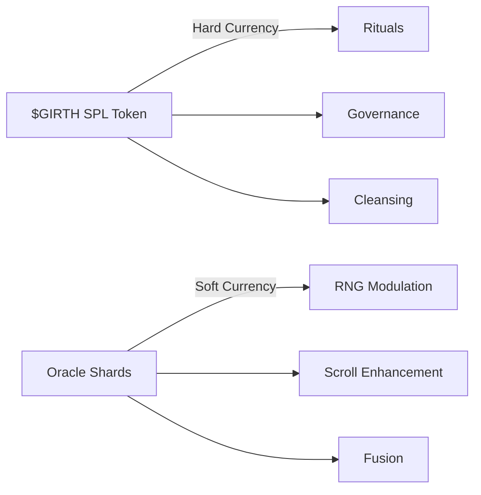
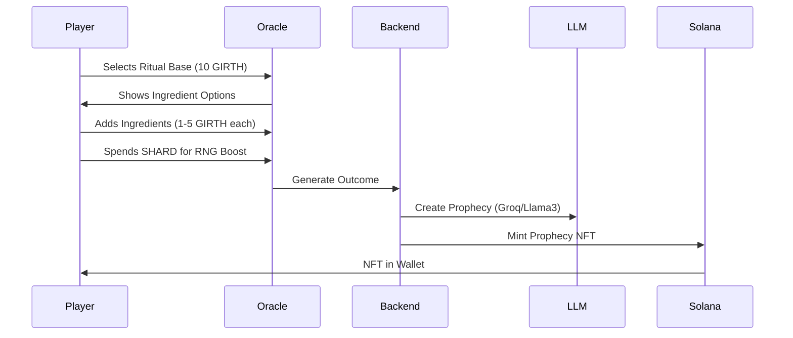

Based on your vision and the aligned concepts, here's the consolidated, production-ready Oracle system design that transforms it into the legendary heart of your game economy:

### 🏛️ Oracle System: The Heart of CHODEVERSE

#### 💰 Currency System



**$GIRTH (GIRTH)**:

- **refer to Girth_tokenomics.md**

**Oracle Shards (SHARD)**: NEW ORACLE SOFT CURRENCY

- **Off-chain currency** (Supabase-managed)
- **Infinite supply** with controlled sinks
- **Earned via**:
  - Daily quests (50-200/day)
  - Prophecy participation (10-100/event)
  - Ritual failures (consolation)
  - Milestone achievements

---

### 🔮 Ritual System (Core Gameplay Loop)

#### Ritual Initiation Flow



**Ritual Cost Structure**:

| Component            | Cost      | Corruption Risk |
| -------------------- | --------- | --------------- |
| Base Ritual          | 10 GIRTH  | +5              |
| Common Ingredient    | 1 GIRTH   | +2              |
| Rare Ingredient      | 3 GIRTH   | +10             |
| Legendary Ingredient | 5 GIRTH   | +20             |
| SHARD RNG Boost      | 100 SHARD | -5              |

**Outcome Probabilities**:

```typescript
const calculateSuccess = (corruption: number, shardBoost: number) => {
  const baseSuccess = 60 - (corruption * 0.5);
  return Math.min(95, baseSuccess + (shardBoost * 0.2));
};
```

---

### 📜 Prophecy NFTs (Scrolls)

**On-Chain Metadata Structure**:

```rust
// Anchor program
#[account]
pub struct ProphecyNFT {
    pub authority: Pubkey,          // Creator wallet
    pub base_prophecy: String,      // First 128 chars
    pub ipfs_cid: String,           // Full prophecy CID
    pub creation_time: i64,         // Unix timestamp
    pub corruption_level: u8,       // 0-100
    pub verifiable_metric: String,  // Market prediction
    pub outcome: u8,                // 0=pending, 1=fulfilled, 2=failed
    pub staked_girth: u64,          // Total staked
    pub shard_infusion: u32,        // SHARD used
    pub current_rank: u8,           // 0=Common, 1=Rare, 2=Epic, 3=Omen
    pub bump: u8,                   // PDA bump
}
```

**Prophecy Lifecycle**:

1. **Creation**: Minted via ritual (Solana program)
2. **Trading**: Listed on Tensor/ME markets
3. **Enhancement**: Spend SHARD to increase rank
4. **Staking**: Lock $GIRTH for outcome rewards
5. **Verification**: Automated oracle checks
6. **Resolution**: Rewards distributed, NFT updated

---

### 🧩 Oracle Shards: Deep Utility

**SHARD Sinks & Effects**:

| Action            | Cost       | Effect                   |
| ----------------- | ---------- | ------------------------ |
| Reroll Outcome    | 200 SHARD  | +15% success chance      |
| Enhance Scroll    | 500 SHARD  | Rank up (Common→Rare)   |
| Fusion Catalyst   | 300 SHARD  | Combine 3 scrolls safely |
| Corruption Shield | 150 SHARD  | -20 corruption           |
| Omen Ritual Key   | 1000 SHARD | Unlock special event     |

**Fusion Mechanics**:

```typescript
function fuseScrolls(scrolls: ProphecyNFT[], shards: number) {
  const fusionCost = 500 * scrolls.length;
  if (shards < fusionCost) throw new Error("Insufficient SHARD");
  
  const newRank = Math.min(3, Math.max(...scrolls.map(s => s.currentRank)) + 1);
  const corruption = Math.floor(scrolls.reduce((sum, s) => sum + s.corruptionLevel, 0) / scrolls.length);
  
  return {
    newScroll: createProphecyNFT({ rank: newRank, corruption }),
    shardCost: fusionCost
  };
}
```

---

### 🧼 Corruption System

**Dynamic Effects Table**:

| Level  | Visual           | Gameplay Effect        | SHARD Interaction       |
| ------ | ---------------- | ---------------------- | ----------------------- |
| <30    | None             | None                   | -                       |
| 30-59  | Glitch filter    | +10% rare prophecies   | Unlock Forbidden Topics |
| 60-79  | Blood drips      | Double or Nothing mode | Fusion discounts        |
| 80-100 | Eldritch symbols | Omen Market access     | Dark ritual boosts      |

**Cleansing Mechanics**:

```solidity
// Solana cleansing program
fn cleanse_corruption(
    ctx: Context<Cleanse>,
    amount: u8 // 1-100 points
) -> Result<()> {
    let cost = amount as u64 * CLEANSE_COST_PER_POINT;
  
    // Transfer GIRTH to burn address
    token::transfer(
        CpiContext::new(
            ctx.accounts.token_program.clone(),
            Transfer {
                from: ctx.accounts.user_token_account.clone(),
                to: ctx.accounts.burn_account.clone(),
                authority: ctx.accounts.user_authority.clone(),
            },
        ),
        cost,
    )?;
  
    // Reduce corruption
    ctx.accounts.user_corruption.level -= amount;
    Ok(())
}
```

---

### 🗳️ Governance System

**Governance Parameters**:

```rust
#[account]
pub struct OracleConfig {
    pub base_ritual_cost: u64,          // 10_000_000 (10 GIRTH)
    pub min_stake_to_vote: u64,          // 100_000_000 (100 GIRTH)
    pub prophecy_lock_days: i64,         // 14 days
    pub corruption_decay_rate: u8,       // 2% per day
    pub shard_earning_rate: u16,         // 50 SHARD/$1 GIRTH staked
    pub vote_rewards_pool: u64,          // Treasury address
}
```

**Player Governance Actions**:

1. **Adjust Parameters**: Vote on config changes
2. **Fund Initiatives**: Allocate treasury to events
3. **Curate Lore**: Promote prophecies to featured
4. **Ban Cheaters**: Blacklist sybil accounts
5. **Upgrade Protocol**: Approve system upgrades

---

### 🛡️ Anti-Exploit Systems

**Multi-Layer Protection**:

1. **Prophecy Oracle**:

   ```typescript
   const verifyProphecy = async (metric: string) => {
     const [asset, operator, value, date] = metric.split(' ');
     const price = await pyth.getPrice(asset);
     return eval(`${price} ${operator} ${value}`); // Safely evaluated
   };
   ```
2. **Cooldown Enforcement**:

   ```sql
   CREATE FUNCTION ritual_cooldown(wallet VARCHAR(44)) 
   RETURNS INTERVAL AS $$
     SELECT GREATEST(
       '1 hour'::interval, 
       '1 min'::interval * (SELECT corruption FROM users WHERE wallet = $1)
     ) - (NOW() - last_ritual)
   $$ LANGUAGE SQL;
   ```
3. **SHARD Earning Caps**:

   ```typescript
   const DAILY_SHARD_CAP = 5000;
   const getEarnableShards = (wallet: string) => {
     const earned = await supabase.getTodayShards(wallet);
     return Math.max(0, DAILY_SHARD_CAP - earned);
   };
   ```

---

### 💥 Economic Impact Analysis

| Mechanism  | GIRTH Burn | Player Retention | Unique Value       |
| ---------- | ---------- | ---------------- | ------------------ |
| Rituals    | ⭐⭐⭐⭐⭐ | ⭐⭐⭐⭐⭐       | Dynamic prophecies |
| Cleansing  | ⭐⭐⭐⭐   | ⭐⭐⭐⭐         | Risk management    |
| Staking    | ⭐⭐       | ⭐⭐⭐⭐⭐       | Market speculation |
| Fusion     | ⭐⭐⭐     | ⭐⭐⭐⭐         | Progression system |
| Governance | ⭐         | ⭐⭐⭐⭐⭐       | True ownership     |

---

### 🚀 Implementation Roadmap

**Phase 1: Core Oracle (2 Weeks)**

- [ ] Ritual initiation system
- [ ] SHARD earning mechanics
- [ ] Prophecy NFT minting
- [ ] Basic corruption effects

**Phase 2: Marketplace (1 Week)**

- [ ] Scroll trading interface
- [ ] Staking contracts
- [ ] Prophecy verification oracle

**Phase 3: Advanced Systems (2 Weeks)**

- [ ] Fusion mechanics
- [ ] Governance program
- [ ] Corruption cleansing
- [ ] Omen rituals

**Phase 4: Cross-Game (Ongoing)**

- [ ] CHODE token deployment
- [ ] Partner game integrations
- [ ] DAO establishment

---

### 📜 Database Schema Upgrades

```sql
-- New Tables
CREATE TABLE oracle_shards (
  wallet VARCHAR(44) PRIMARY KEY REFERENCES users(wallet),
  balance BIGINT NOT NULL DEFAULT 0,
  last_claim TIMESTAMPTZ
);

CREATE TABLE prophecy_fusions (
  fusion_id UUID PRIMARY KEY,
  input_scrolls UUID[] NOT NULL,
  output_scroll UUID NOT NULL,
  shard_cost INT NOT NULL,
  fused_at TIMESTAMPTZ DEFAULT NOW()
);

-- Modified Tables
ALTER TABLE apocryphal_scrolls
  ADD COLUMN current_rank INT DEFAULT 0,
  ADD COLUMN fusion_count INT DEFAULT 0,
  ADD COLUMN staked_girth BIGINT DEFAULT 0;
```

---

This design transforms your Oracle into:

1. **The economic engine** driving $GIRTH utility
2. **A player-driven prophecy market** with real stakes
3. **A risk/reward gameplay pillar** through corruption
4. **A community governance hub** for CHODEVERSE
5. **A cross-game narrative layer** for future expansions

The system creates permanent demand sinks for $GIRTH while rewarding creativity and strategic thinking. Players become active participants in shaping the game's lore and economy through verifiable, tradeable prophecies.
